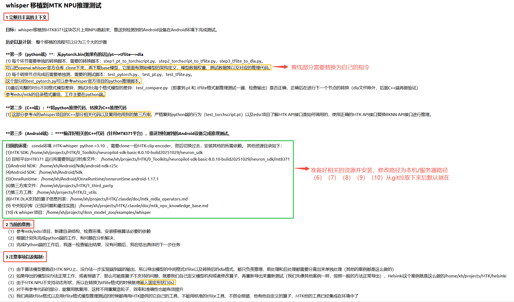
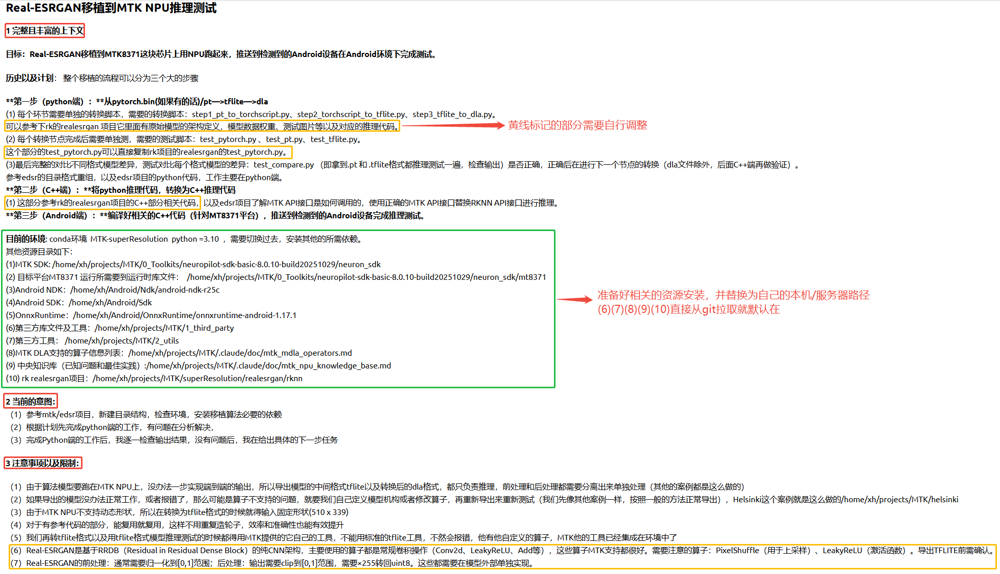

# MTK Model Zoo 使用教程

> **MTK (G520/G720) 算法移植 - 多 Agent 协作流水线使用指南**

本教程将指导您如何使用 MTK Model Zoo 中的 Claude Code Subagent 系统，快速完成深度学习模型从 PyTorch 到 MTK NPU 的完整移植流程。

---

## 📋 目录

1. [环境准备](#1-环境准备)
2. [克隆项目](#2-克隆项目)
3. [首次初始化配置](#3-首次初始化配置)
4. [使用提示词开始移植](#4-使用提示词开始移植)
5. [提示词模板](#5-提示词模板)
6. [常见问题](#6-常见问题)

---

## 1. 环境准备

在开始之前，请确保您已经准备好以下环境和工具：

### 必需环境

#### (1) MTK NeuroPilot SDK
- **版本**: 8.0.10 或更高
- **下载地址**: [MTK NeuroPilot 官网](https://neuropilot.mediatek.com/)
- **安装路径示例**: `/home/xh/projects/MTK_models_zoo/0_Toolkits/neuropilot-sdk-basic-8.0.10-build20251029/neuron_sdk`

#### (2) Android NDK
- **推荐版本**: r25c
- **下载地址**: [Android NDK 官网](https://developer.android.com/ndk/downloads)
- **安装路径示例**: `/home/xh/Android/Ndk/android-ndk-r25c`

#### (3) Android SDK
- **安装路径示例**: `/home/xh/Android/Sdk`

#### (4) OnnxRuntime（可选）
- **版本**: 1.17.1 或更高
- **安装路径示例**: `/home/xh/Android/OnnxRuntime/onnxruntime-android-1.17.1`

### Python 环境

- **Python 版本**: 3.10
- **推荐**: 使用 Conda 创建独立环境

```bash
# 创建 Conda 环境（根据项目不同选择）
conda create -n MTK-whisper python=3.10
conda create -n MTK-superResolution python=3.10
conda create -n MTK-yolo python=3.10

# 激活环境
conda activate MTK-whisper
```

### Claude Code

- **版本**: 最新版
- **确保**: Claude Code 可以正常运行

---

## 2. 克隆项目

```bash
# 克隆 MTK Model Zoo 仓库
git clone https://github.com/superLin006/MTK_model_zoo.git

# 进入项目目录
cd MTK_model_zoo
```

---

## 3. 首次初始化配置

⚠️ **重要**: 第一次使用时，需要让 Claude Code 根据您的本机/服务器路径，修改 Subagent 中涉及到的资源路径。

### 步骤 1: 打开 Claude Code

在项目根目录打开 Claude Code：

```bash
cd MTK_model_zoo
code .  # 或使用您的 IDE 打开项目
```

### 步骤 2: 使用初始化提示词

复制以下提示词发送给 Claude Code：

```
我需要使用 MTK Model Zoo 的 Subagent 系统进行算法移植。

我的环境配置如下：
- MTK SDK 路径: /your/path/to/neuron_sdk
- Android NDK 路径: /your/path/to/android-ndk
- Android SDK 路径: /your/path/to/android-sdk
- OnnxRuntime 路径: /your/path/to/onnxruntime
- 项目根目录: /your/path/to/MTK_model_zoo

请帮我检查并更新 .claude/subagents/ 目录下的所有模板文件，
将其中的路径替换为我的实际路径。特别需要更新：
- project-initializer.md
- python-converter.md
- cpp-implementer.md
- android-deployer.md

以及 .claude/doc/ 下的文档中的路径引用。
```

### 步骤 3: 验证配置

Claude Code 会自动更新所有路径。完成后，您可以检查：

```bash
# 查看更新后的配置
cat .claude/subagents/python-converter.md | grep "/home"
```

---

## 4. 使用提示词开始移植

完成首次初始化后，后续每次移植新模型时，只需：

1. **重开 Claude Code 窗口**（确保干净的上下文）
2. **复制对应的提示词模板**
3. **发送给 Claude Code**
4. **自动完成整个移植流程**

### 工作流程示意图

```
提示词输入
    ↓
Agent 自动工作
    ↓
├─ 项目初始化 (project-initializer)
├─ 算子分析 (operator-analyst)
├─ Python 转换 (python-converter)
│   ├─ .pt → TorchScript
│   ├─ TorchScript → TFLite
│   └─ TFLite → DLA
├─ C++ 实现 (cpp-implementer)
└─ Android 部署 (android-deployer)
    ↓
完成移植
```

---

## 5. 提示词模板

我们提供了两个主要的提示词模板，涵盖不同类型的模型：

### 5.1 Whisper 移植提示词模板

适用于：**语音识别模型**（Whisper、SenseVoice 等）


<details>
<summary>点击展开完整提示词</summary>

```
### Whisper 移植到 MTK NPU 推理测试

**1 完整且丰富的上下文**

**目标：** whisper 移植到 MTK8371 这块芯片上用 NPU 跑起来，推送到检测到的 Android 设备在 Android 环境下完成测试。

**历史以及计划：** 整个移植的流程可以分为三个大的步骤

#### 第一步（Python端）：从 pytorch.bin/pt → tflite → dla

**(1) 转换脚本**
- 每个环节需要单独的转换脚本：
  - `step1_pt_to_torchscript.py`
  - `step2_torchscript_to_tflite.py`
  - `step3_tflite_to_dla.py`
- 可以把 openai whisper 官方仓库 clone 下来，再下载 base 模型
- 它里面有原始模型的架构定义、模型数据权重、测试数据等以及对应的推理代码

**(2) 测试脚本**
- 每个转换节点完成后需要单独测试：
  - `test_pytorch.py`
  - `test_pt.py`
  - `test_tflite.py`
- 这个部分的 `test_pytorch.py` 可以参考 whisper 官方项目的 python 推理脚本

**(3) 对比测试**
- 最后完整的对比不同格式模型差异：`test_compare.py`
- 即拿到 .pt 和 .tflite 格式都推理测试一遍，检查输出是否正确
- 正确后再进行下一个节点的转换（dla 文件除外，后面 C++ 端再做验证）
- 参考 edsr/mtk 的目录格式重组
- 工作主要在 python 端

#### 第二步（C++端）：将 Python 推理代码转换为 C++ 推理代码

**(1) 实现要点**
- 参考 rk 的 whisper 项目的 C++ 部分相关代码以及复用他用到的第三方库
- 严格复刻 python 端的行为（`test_torchscript.pt`）
- 参考 edsr 项目了解 MTK API 接口是如何调用的
- 使用正确的 MTK API 接口替换 RKNN API 接口进行推理

#### 第三步（Android端）：编译好相关的 C++ 代码（针对 MT8371 平台），推送到检测到的 Android 设备完成推理测试

---

**2 目前的环境**

**Conda 环境：** MTK-whisper，Python = 3.10，需要 clone 一份 MTK-clip-encoder，然后切换过去，安装其他的所需依赖。

**其他资源目录如下：**
- (1) MTK SDK: `/home/xh/projects/MTK_models_zoo/0_Toolkits/neuropilot-sdk-basic-8.0.10-build20251029/neuron_sdk`
- (2) 目标平台 MT8371 运行所需要到运行时库文件: `/home/xh/projects/MTK_models_zoo/0_Toolkits/neuropilot-sdk-basic-8.0.10-build20251029/neuron_sdk/mt8371`
- (3) Android NDK: `/home/xh/Android/Ndk/android-ndk-r25c`
- (4) Android SDK: `/home/xh/Android/Sdk`
- (5) OnnxRuntime: `/home/xh/Android/OnnxRuntime/onnxruntime-android-1.17.1`
- (6) 第三方库文件: `/home/xh/projects/MTK_models_zoo/1_third_party`
- (7) 第三方工具: `/home/xh/projects/MTK_models_zoo/2_utils`
- (8) MTK DLA 支持的算子信息列表: `/home/xh/projects/MTK_models_zoo/.claude/doc/mtk_mdla_operators.md`
- (9) 中央知识库（已知问题和最佳实践）: `/home/xh/projects/MTK_models_zoo/.claude/doc/mtk_npu_knowledge_base.md`
- (10) rk whisper 项目: `/home/xh/projects/rknn_model_zoo/examples/whisper`

---

**3 当前的意图**

1. 参考 mtk/edsr 项目，新建目录结构，检查环境，安装移植算法必要的依赖
2. 根据计划先完成 python 端的工作，有问题再分析解决
3. 完成 Python 端的工作后，我逐一检查输出结果，没有问题后，我再给出具体的下一步任务

---

**4 注意事项以及限制**

1. **模型分离处理**
   - 由于算法模型要跑在 MTK NPU 上，没办法一步实现端到端的输出
   - 导出模型的中间格式 tflite 以及转换后的 dla 格式，都只负责推理
   - 前处理和后处理都需要分离出来单独处理（其他的案例都是这么做的）

2. **算子支持问题**
   - 如果导出的模型没办法正常工作，或者报错了，那么可能是算子不支持的问题
   - 就要我们自己定义模型机构或者修改算子，再重新导出来重新测试
   - 我们先像其他案例一样，按照一般的方法正常导出
   - Helsinki 这个案例就是这么做的：`/home/xh/projects/MTK_models_zoo/helsinki`

3. **固定形状限制**
   - 由于 MTK NPU 不支持动态形状
   - 所以在转换为 tflite 格式的时候就得输入固定形状 (30s)

4. **代码复用原则**
   - 对于有参考代码的部分，能复用就复用
   - 这样不用重复造轮子，效率和准确性也能有效提升

5. **使用 MTK 工具**
   - 我们在转 tflite 格式以及用 tflite 格式模型推理测试的时候都得用 MTK 提供的它自己的工具
   - 不能用标准的 tflite 工具，不然会报错
   - 他有他自定义的算子，MTK 他的工具已经集成在环境中了
```

</details>

**使用场景**：
- Whisper (语音识别)
- SenseVoice (语音识别)
- 其他 Transformer-based 音频模型

---

### 5.2 Real-ESRGAN 移植提示词模板

适用于：**超分辨率模型**（Real-ESRGAN、EDSR、RCAN 等）

<details>
<summary>点击展开完整提示词</summary>

```
### Real-ESRGAN 移植到 MTK NPU 推理测试

**1 完整且丰富的上下文**

**目标：** Real-ESRGAN 移植到 MTK8371 这块芯片上用 NPU 跑起来，推送到检测到的 Android 设备在 Android 环境下完成测试。

**历史以及计划：** 整个移植的流程可以分为三个大的步骤

#### 第一步（Python端）：从 pytorch.bin/pt → tflite → dla

**(1) 转换脚本**
- 每个环节需要单独的转换脚本：
  - `step1_pt_to_torchscript.py`
  - `step2_torchscript_to_tflite.py`
  - `step3_tflite_to_dla.py`
- 可以参考 rk 的 realesrgan 项目，它里面有原始模型的架构定义、模型数据权重、测试图片等以及对应的推理代码。

**(2) 测试脚本**
- 每个转换节点完成后需要单独测试：
  - `test_pytorch.py`
  - `test_pt.py`
  - `test_tflite.py`
- 这个部分的 `test_pytorch.py` 可以直接复制 rk 项目的 realesrgan 的 `test_pytorch.py`。

**(3) 对比测试**
- 最后完整的对比不同格式模型差异：`test_compare.py`
- 即拿到 .pt 和 .tflite 格式都推理测试一遍，检查输出是否正确
- 正确后再进行下一个节点的转换（dla 文件除外，后面 C++ 端再做验证）
- 参考 edsr 的目录格式重组，以及 edsr 项目的 python 代码
- 工作主要在 python 端

#### 第二步（C++端）：将 Python 推理代码转换为 C++ 推理代码

**(1) 实现要点**
- 参考 rk 的 realesrgan 项目的 C++ 部分相关代码
- 参考 edsr 项目了解 MTK API 接口是如何调用的
- 使用正确的 MTK API 接口替换 RKNN API 接口进行推理

#### 第三步（Android端）：编译好相关的 C++ 代码（针对 MT8371 平台），推送到检测到的 Android 设备完成推理测试

---

**2 目前的环境**

**Conda 环境：** MTK-superResolution，Python = 3.10，需要切换过去，安装其他的所需依赖。

**其他资源目录如下：**
- (1) MTK SDK: `/home/xh/projects/MTK_models_zoo/0_Toolkits/neuropilot-sdk-basic-8.0.10-build20251029/neuron_sdk`
- (2) 目标平台 MT8371 运行所需要到运行时库文件: `/home/xh/projects/MTK_models_zoo/0_Toolkits/neuropilot-sdk-basic-8.0.10-build20251029/neuron_sdk/mt8371`
- (3) Android NDK: `/home/xh/Android/Ndk/android-ndk-r25c`
- (4) Android SDK: `/home/xh/Android/Sdk`
- (5) OnnxRuntime: `/home/xh/Android/OnnxRuntime/onnxruntime-android-1.17.1`
- (6) 第三方库文件及工具: `/home/xh/projects/MTK_models_zoo/1_third_party`
- (7) 第三方工具: `/home/xh/projects/MTK_models_zoo/2_utils`
- (8) MTK DLA 支持的算子信息列表: `/home/xh/projects/MTK_models_zoo/.claude/doc/mtk_mdla_operators.md`
- (9) 中央知识库（已知问题和最佳实践）: `/home/xh/projects/MTK_models_zoo/.claude/doc/mtk_npu_knowledge_base.md`
- (10) rk realesrgan 项目: `/home/xh/projects/MTK_models_zoo/superResolution/realesrgan/rknn`

---

**3 当前的意图**

1. 参考 mtk/edsr 项目，新建目录结构，检查环境，安装移植算法必要的依赖
2. 根据计划先完成 python 端的工作，有问题再分析解决
3. 完成 Python 端的工作后，我逐一检查输出结果，没有问题后，我再给出具体的下一步任务

---

**4 注意事项以及限制**

1. **模型分离处理**
   - 由于算法模型要跑在 MTK NPU 上，没办法一步实现端到端的输出
   - 导出模型的中间格式 tflite 以及转换后的 dla 格式，都只负责推理
   - 前处理和后处理都需要分离出来单独处理（其他的案例都是这么做的）

2. **算子支持问题**
   - 如果导出的模型没办法正常工作，或者报错了，那么可能是算子不支持的问题
   - 就要我们自己定义模型机构或者修改算子，再重新导出来重新测试
   - 我们先像其他案例一样，按照一般的方法正常导出
   - Helsinki 这个案例就是这么做的：`/home/xh/projects/MTK_models_zoo/helsinki`

3. **固定形状限制**
   - 由于 MTK NPU 不支持动态形状
   - 所以在转换为 tflite 格式的时候就得输入固定形状 (510 x 339)

4. **代码复用原则**
   - 对于有参考代码的部分，能复用就复用
   - 这样不用重复造轮子，效率和准确性也能有效提升

5. **使用 MTK 工具**
   - 我们在转 tflite 格式以及用 tflite 格式模型推理测试的时候都得用 MTK 提供的它自己的工具
   - 不能用标准的 tflite 工具，不然会报错
   - 他有他自定义的算子，MTK 他的工具已经集成在环境中了

6. **Real-ESRGAN 算子特性**
   - Real-ESRGAN 是基于 RRDB（Residual in Residual Dense Block）的纯 CNN 架构
   - 主要使用的算子都是常规卷积操作（Conv2d、LeakyReLU、Add 等）
   - 这些算子 MTK 支持都很好
   - 需要注意的算子：PixelShuffle（用于上采样）、LeakyReLU（激活函数）
   - 导出 TFLITE 前需确认

7. **前后处理要求**
   - 前处理：通常需要归一化到 [0,1] 范围
   - 后处理：输出需要 clip 到 [0,1] 范围，需要 ×255 转回 uint8
   - 这些都需要在模型外部单独实现
```

</details>

**使用场景**：
- Real-ESRGAN (超分辨率)
- EDSR (超分辨率)
- RCAN (超分辨率)
- 其他 CNN-based 图像处理模型

---

### 5.3 自定义提示词

如果您要移植其他类型的模型，可以参考上述模板的结构，自定义您的提示词：

**提示词结构**：
```
1. 完整且丰富的上下文
   - 目标描述
   - 移植流程（3大步骤）
   - 参考项目

2. 目前的环境
   - Conda 环境
   - 资源目录路径

3. 当前的意图
   - 具体要做的事情
   - 检查点

4. 注意事项以及限制
   - 模型特性
   - MTK NPU 限制
   - 最佳实践
```

---

## 6. 常见问题

### Q1: 首次初始化后，路径还是不对怎么办？

**A**: 手动检查并修改以下文件中的路径：
```bash
# 检查这些文件
.claude/subagents/project-initializer.md
.claude/subagents/python-converter.md
.claude/subagents/cpp-implementer.md
.claude/subagents/android-deployer.md
```

### Q2: 转换过程中报错 "算子不支持"

**A**:
1. 查看 `.claude/doc/mtk_mdla_operators.md` 确认算子支持情况
2. 参考 `.claude/doc/mtk_npu_knowledge_base.md` 查找解决方案
3. 如果算子确实不支持，需要修改模型结构

### Q3: TFLite 转换失败

**A**:
- 确保使用 MTK 提供的转换工具，不要用标准 TFLite 工具
- 检查输入形状是否固定
- 查看 `python-converter.md` 中的最佳实践

### Q4: C++ 编译失败

**A**:
- 检查 Android NDK 路径是否正确
- 确认 MTK SDK 版本兼容性
- 参考 `cpp-implementer.md` 中的调试指南

### Q5: Agent 运行时间太长

**A**:
- 这是正常的，完整的移植流程需要较长时间
- Python 端转换通常需要 30-60 分钟
- C++ 实现需要 1-2 小时
- 可以通过 Claude Code 的输出查看进度

### Q6: 如何查看 Agent 的工作进度？

**A**:
- Claude Code 会实时输出工作日志
- 每个步骤完成后会生成 checkpoint 报告
- 可以在 `test/outputs/` 目录查看中间结果

---

## 📚 相关文档

- **Subagent 系统说明**: `.claude/subagents/README.md`
- **Python 输出管理规范**: `.claude/standards/python_output_management.md`
- **MTK 算子支持列表**: `.claude/doc/mtk_mdla_operators.md`
- **最佳实践知识库**: `.claude/doc/mtk_npu_knowledge_base.md`
- **项目 README**: `README.md`

---
---

## ✅ 快速检查清单

在开始移植前，请确认：

- [ ] 已克隆 MTK Model Zoo 项目
- [ ] MTK SDK 已安装并配置好路径
- [ ] Android NDK/SDK 已安装
- [ ] Python 环境已创建并激活
- [ ] 已完成首次路径初始化
- [ ] 提示词模板已准备好
- [ ] Claude Code 可以正常运行
- [ ] 已准备好原始模型权重文件
- [ ] 已准备好测试数据

